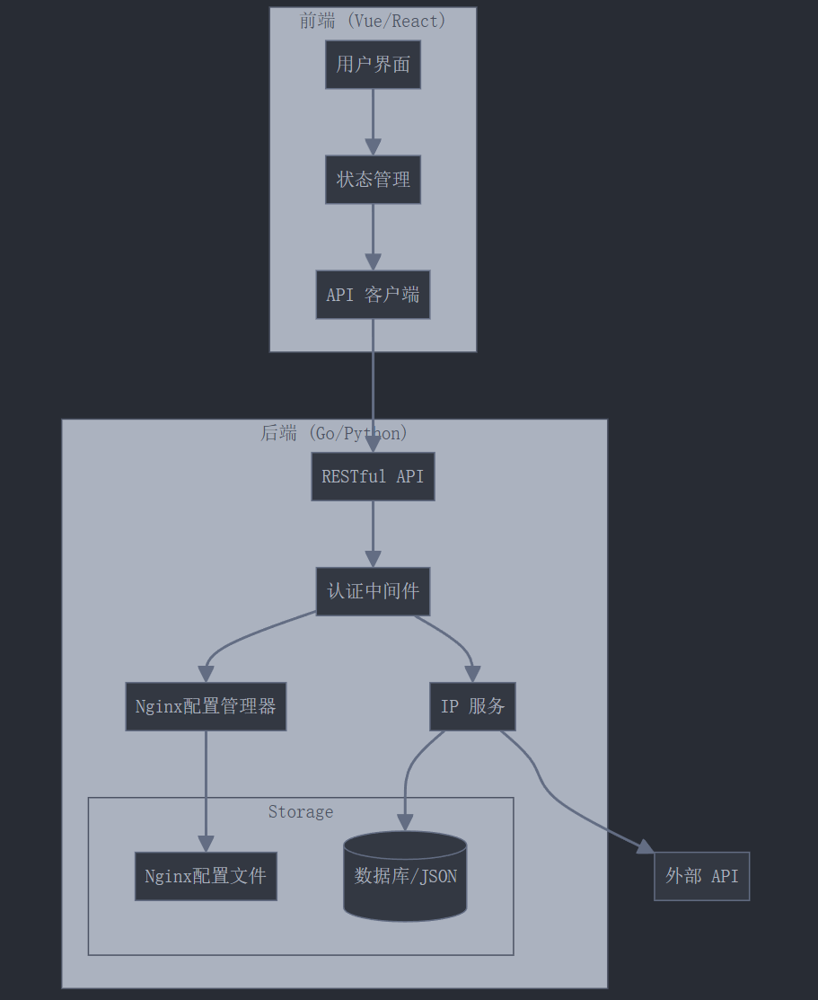
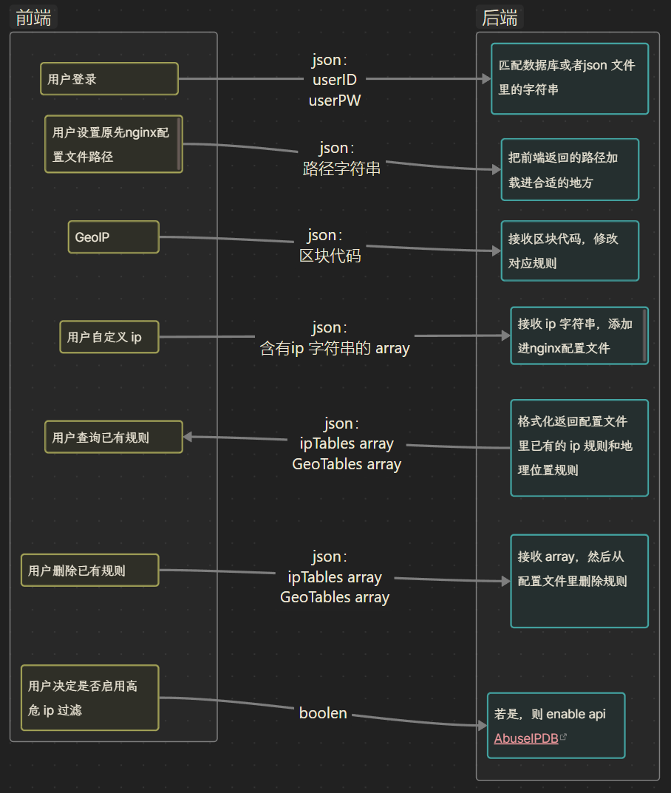

# nginx_ip_copilot

> 这是一个 Nginx 工具，使用户能根据地理位置和在线ip黑名单来禁用特定 ip ，以及自己设置需要禁用的 ip。并有友好的 UI 界面

> 本文中的所有“用户”均指网站的管理者，我们设计的系统是一个提供给网站管理者的界面，使得其能够通过`ip:port`访问到这个管理界面并且进行系列操作

## 初步构思

### 功能

#### 用户登录模块

userid; userps；  json

##### 实现方式

方式1（高级）： mysql数据库匹配
方式2（简单）： 维护一个存放账号密码的 json 文件

#### 用户设置配置文件的路径

用户指定使用的网站配置文件路径，比如 `/etc/nginx/conf.d/mypapers.conf`

#### GepIP 筛选

屏蔽来自指定位置 ip 请求的功能，比如禁止某个国家的人访问我的网站
前端发送用户设置的位置代码给后端； json

##### 实现方式

方式1（简单）： 查询 ip 信息的 api：`https://api.vore.top/api/IPdata?ip=输入你要查询的ip地址`
方式2（高级）： 使用 ngx_http_geoip2 模块

#### 用户自定义 ip 过滤规则

前端发送给后端的字段：  array，一系列 ipv4 地址

#### 用户查询已有的规则

前端请求后端返回 array ，后端查询已有规则并且返回给前端，前端格式化成 table 给用户呈现

#### 用户删除已有规则

前端发送给后端的字段： 含有 ip 的字符串

#### （可选）调用 AbuseIPDB api ，禁止数据库里的高危 ip

前端返回给后端布尔值 boolen，后端接收后决定 enable 或者 disable 这个功能
用到的api 网站：[AbuseIPDB](https://www.abuseipdb.com/)

### 细节

#### 前端

##### 技术

- Vue3 + TypeScript
- Element Plus UI 框架
- Axios 处理 API 请求
- Vuex 状态管理

#### 后端

##### 技术

- java spring boot
- Mysql 数据库 （可选）

##### 关键

###### 1. 维护`block_ips.conf` 文件

所有的规则信息可以存在`block_ips.conf`里

###### 2. 自动给 nginx config 文件导入配置文件

通过`include /path/to/block_ips.conf`把文件集成到原先设定的路径（比如`/etc/nginx/conf.d/mypapers.conf`）

# 项目框架

## 进度安排

- 第一阶段：

基础用户认证
Nginx 配置文件管理
简单的 IP 规则管理

- 第二阶段：

GeoIP 功能
IP 规则批量管理
基础数据可视化

- 第三阶段：

高危 IP 防护
高级数据可视化

## 系统架构图

## 前后端交互

